# 🔐 Internship Project: Open-Source SOC Stack for Threat Detection & Response

**🧑‍💻 Role:** Cybersecurity Enginner Intern  
**📅 Duration:** 8 Weeks  
**📂 Project Type:** End-to-End Security Monitoring & Automation using Open Source Tools

---

## 🧩 Overview

Built a comprehensive open-source **Security Operations Center (SOC)** stack by integrating SIEM, EDR, SOAR, and threat intelligence. The solution supports real-time detection, enrichment, and automated response to adversary techniques in a simulated enterprise environment.

---
## 🧭 Project Architecture

---

## ⚙️ Key Features

### 🔍 SIEM Deployment (Wazuh 4.12)
- Installed and configured **Wazuh** on Ubuntu with Linux and Windows agents.
- Enabled log collection for system events, audit logs, and database logs (**MariaDB & PostgreSQL**).
- Used `rsyslog` and custom JSON-export scripts for log forwarding.

### 🧠 Threat Intelligence Enrichment
- Integrated **MISP** and **VirusTotal** APIs for automatic enrichment of:
  - File hashes
  - IP addresses
  - Filenames (flagged even on name match)
- Enriched Wazuh alerts with contextual threat intelligence.

### 🚀 SOAR Automation using Shuffle
- Developed workflows in **Shuffle 1.4.0** to:
  - Parse IOCs from Wazuh alerts using JSONPath
  - Query MISP and VirusTotal
  - Trigger Slack/email alerts for positive matches
- Reduced mean time to respond (MTTR) and minimized manual triage.

### 🛡 Endpoint Visibility with Velociraptor
- Deployed **Velociraptor** for endpoint monitoring and forensics.
- Queried:
  - Running processes
  - Startup scripts
  - Persistence mechanisms
  - Registry changes
- Enabled live threat hunting and anomaly detection.

### 🛑 Active Defense with Fail2Ban
- Configured **Fail2Ban** to monitor `/var/log/auth.log` for brute-force attempts.
- Automatically banned offending IPs and forwarded events to Wazuh.

### 🧪 Adversary Simulation (Atomic Red Team)
- Used **Atomic Red Team (ART)** to simulate real-world attacks (e.g., T1003 – Credential Dumping).
- Validated Wazuh’s detection rules and alerting mechanisms.

### 📊 Dashboards & Visualization
- Created custom dashboards in **Kibana** for:
  - Linux and Windows activity
  - Threat enrichment hits
  - Fail2Ban events
  - Simulated attacks and correlation maps

---

## 🧰 Tech Stack
•Wazuh 
• MISP 
•VirusTotal 
• Velociraptor 
• Shuffle SOAR 
• Atomic Red Team
•Fail2Ban 
• PostgreSQL 
• MariaDB 
•Python 
• Bash 
• Sysmon

## ✅ Outcomes

- 🚀 Built a fully functional lab prototype of a SOC platform using open-source tools — designed for realistic threat detection and automation simulations.
- 🔁 Achieved full-stack automation from detection to response using Wazuh + Shuffle.
- 🎯 Hands-on experience across **SIEM tuning, SOAR automation, EDR, and threat simulation**.
- 📈 Developed executive-ready dashboards to visualize attack surface and mitigation status.

---

## 🚀 Future Plans

Now that my internship project is complete, I’m continuing to build upon this experience with the following goals:

| Focus Area                | Next Steps                                                                 |
|--------------------------|-----------------------------------------------------------------------------|
| 🛠 Project Expansion      | Refactor and modularize the lab for better replication and public tutorials |
| 📦 Dockerization         | Containerize all components (Wazuh, MISP, Velociraptor) for portability     |
| 📊 Visualization         | Explore integrating Kibana or Grafana for visual dashboards                 |
| 🔄 Threat Response       | Build bi-directional workflows in Shuffle (e.g., auto-banning IPs)          |
| 📁 IOC Management        | Use TheHive or Cortex to manage alerts and observables                      |
| 🔒 EDR Enrichment        | Deepen Velociraptor usage for behavioral baselining and anomaly hunting     |
| 🧪 Red Team Testing      | Simulate advanced attack chains (e.g., MITRE ATT&CK chains) using ART       |
| 🧑‍💻 Community Sharing   | Write tutorials and a full blog series documenting setup + findings         |
| 📚 Certifications        | Prepare for CompTIA Security+, TryHackMe SOC Level 2, and Blue Team labs    |

---

> ✨ *This project helped me identify my interest in blue teaming, SOAR, and threat detection automation. I’m now working toward deeper specialization in these areas through self-study, hands-on labs, and collaboration.*

## 📬 Contact

**Asmit Desai**  
Connect on [LinkedIn](https://www.linkedin.com/in/asmit-desai-858668230/)  
Reach out for collaboration, mentoring, or resume opportunities!

---
